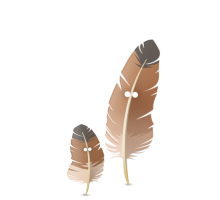

# lika-gvaramashvili-movie-quotes

### Movie quotes App generates random movie quotes. On every refresh of page new movie quote with corresponding poster will be displayed.

### App has admin panel for all crud operations. Admin can create new records or update existing ones.

### To have access on admin panel user should be registered with special artisan command.

## Table of Contents

-   <a href="#prerequisites">Prerequisites</a>
-   <a  href="#tech-stack">Tech Stack</a>
-   <a  href="#getting-started">Getting Started</a>
-   <a  href="#migration">Migration</a>
-   <a  href="#development">Development</a>
-   <a  href="#drawsql-diagram">Drawsql</a>

---

## Prerequisites

-    PHP@8.2.4 and up
-    MYSQL@8.0.32 and up
-    npm@9.5 and up
-    composer@2 and up

---

## Tech Stack

-   
    <a target="_blank" href="https://laravel.com/docs/10.x/installation">
    Laravel@10.x - back-end framework
    </a>

-   
      <a target="_blank" href="https://github.com/spatie/laravel-translatable">
      Spatie Translatable - package for translation
      </a>

-   
    <a target="_blank" href="https://github.com/codezero-be/laravel-unique-translation">
    Codezero-be/laravel-unique-translation - package for translation validation
    </a>

-   
    <a target="_blank" htef="https://redberry.gitbook.io/resources/laravel/php-is-linteri">
    PHP CS Fixer - code formatter
    </a>

-   
     <a target="_blank" htef="https://tailwindui.com">
     Tailwind UI - for markup design
     </a>

---

## Getting Started

1. First of all you need to clone repository from github:

> git clone https://github.com/RedberryInternship/lika-gvaramashvili-movie-quotes.git

2. Next step requires you to run composer install in order to install all the dependencies.

> composer install

3. after you have installed all the PHP dependencies, it's time to install all the JS dependencies:

> npm install

and also:

> npm run dev

in order to build your JS/CSS resources.

4. Now we need to set our env file. Go to the root of your project and execute this command.

> cp .env.example .env

And now you should provide .env file all the necessary environment variables:

---

MYSQL:

> DB_CONNECTION=mysql

> DB_HOST=127.0.0.1

> DB_PORT=3306

> DB_DATABASE=\*\*\*

> DB_USERNAME=\*\*\*

> DB_PASSWORD=\*\*\*

after setting up .env file, execute:

> php artisan config:cache

in order to cache environment variables.

Now, you should be good to go!

---

## Migration

if you've completed getting started section, then migrating database if fairly simple process, just execute:

> php artisan migrate

---

## Development

You can run Laravel's built-in development server by executing:

> php artisan serve

and

> npm run dev

---

## Drawsql Diagram

